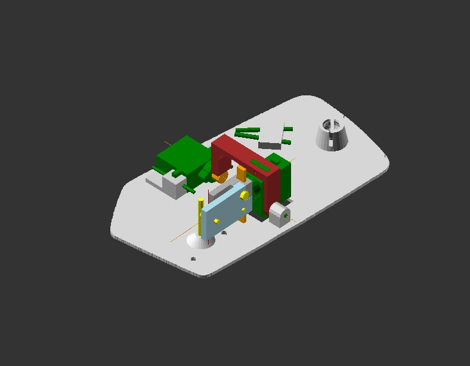

# Enrichng Mercedes W123 conventional mirror with Bluetooth/WiFi

## 3d models
Please update **scale** variable to fit real size. My 3d printer is out-of-service now, so these models were never printed.

## esp32
The code will be uploaded soon

## UI
**Please feel free to join!** The bt profile can be discussed. We could start with blufi.

## To start with
As a temporary solution, [wifi4lego](https://github.com/dmisol/wifi4lego) (esp8266) can be used and should work out of the box.
